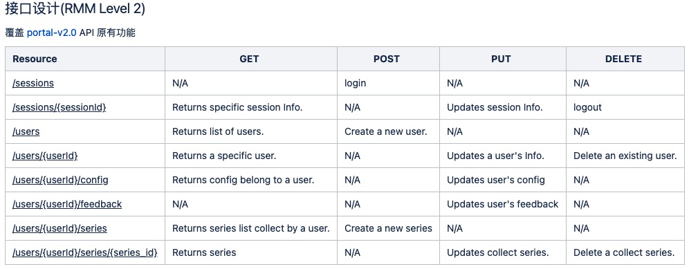

% 面向资源的接口设计
% liyan
% 2021-05-05

## 应用协议/设计方法 概览

### 应用协议一览

- RPC
  - 面向过程，基于 socket
- DICOM
  - 面向影像数据，传输基于 socket
- RESTful
  - 是面向资源的一种编程风格，基于 HTTP
- GraphQL
  - 为 API 而生的查询语言，传输层无关

::: notes

- RPC 基于接口和方法设计，以效率为第一目标
- DICOM
  - Digital Imaging and Communications in Medicine
  - 一组通用的标准协定，规定医学影像如何处理、储存、打印和传输
- RESTful
  - Representation State Transfer
  - 适用于一切网络没有成为性能瓶颈的应用场景

:::

### GraphQL 一瞥

GraphQL支持的数据操作

- 可以与 RESTful API 共存，补足其短板
- 增加服务复杂度，简单 APIs 不推荐

::: notes

[GraphQL 介绍](https://mp.weixin.qq.com/s/2z8-MUYA2eM0P3nUEREFXA)

- 2018年11月7日，Facebook 将 GraphQL 项目转移到新成立的 GraphQL 基金会（隶属于非营利性的 Linux 基金会）
- 既是一种用于 API 的查询语言也是一个满足你数据查询的运行时，可以与 RESTful API 共存
- 请求你所要的数据不多不少
  - 为 API 中的数据提供了一套易于理解的完整描述，使得客户端能够精准获取所需数据，没有任何冗余
- 获取多个资源只用一个请求
- 这种查询语言所带来的灵活性和丰富性的同时也增加了复杂性，简单 APIs 有可能不适合这种方式

:::

### 补足 REST 缺乏对资源进行“部分”和“批量”的处理能力

- 缺少对资源的“部分”操作的支持
  - 避免 Overfetching：在 GET 方法的 Endpoint 上设计各种参数
- 缺少对资源的“批量”操作的支持
  - 要解决批量操作这类问题，目前一种从理论上看还比较优秀的解决方案是 GraphQL

### 设计方法一览

面向过程 -> 面向对象 -> 面向方法 VS 面向资源

| |交互范围 |数据 |方法 |
|--|--|--|--|
|面向过程 |进程内 |Record |Procedure |
|面向对象 |进程内 |Ojbect |Method |
|远程方法调用 |进程间 |Ojbect |Method |
|RESTful |网络内 |资源主体 |统一接口 |

::: notes

- 单体-面向过程
  - <https://en.wikipedia.org/wiki/Procedural_programming>
  - 1970 年代 C / Pascal
- 单体-面向对象设计
  - <https://en.wikipedia.org/wiki/Object-oriented_design>
  - 1970 年代 smalltalk
- 网络-面向方法： 1970 年代
  - <https://en.wikipedia.org/wiki/Remote_procedure_call>
  - 使用面向对象方式进行封装就是面向方法
  - 计算机世界主流的交互方式，重点关注输入输出
- 网络-面向资源： 2010
  - <https://en.wikipedia.org/wiki/Representational_state_transfer>
  - 网络世界主流交互方式：比如前后端分离应用场景

应用场景的差异对比

:::

### 面向资源设计的通用部分

||RESTful|DICOM|
|--|--|--|
|资源|HTTP Resouce | DICOM 数据集 |
|展示|Representation | SoP |
| |一个内容的 HTML/JSON/PDF 版本|/|
| |/ |一套图的 Presentation/Print/GSPS|
|State|上下文|/|

::: notes

- HTTP Resouce / DICOM 数据集
- Representation / Softcopy Presentation
  - REST 一个资源的 HTML/JSON/PDF 版本
  - DICOM 一个图像的彩色/灰度/不同窗宽窗位 显示
- State
  - 在特定语境中才能产生的上下文信息
:::

### 面向资源优于面向方法的地方

- 降低了服务接口的学习成本
- 资源天然具有集合与层次结构
- REST 绑定于 HTTP 协议
  - HTTP 协议有效运作了 30年，与其相关的技术基础设施已是千锤百炼，无比成熟

### Reference 1

- <http://wiki.li3huo.com/RPC>
- <http://wiki.li3huo.com/DICOM>
- <http://wiki.li3huo.com/Representational_State_Transfer>
- <http://wiki.li3huo.com/GraphQL>

## RESTful 接口设计须知

### REST 风格的系统特征

- RESTful 是一种设计风格
- Client-Server 分离结构
  - Server-Side Rendering
- Stateless
  - 上下文信息，会话信息由客户端保存维护，服务器端依据客户端传递的状态信息来进行业务处理
- Cacheability
  - 运作良好的缓存机制可以减少客户端、服务器之间的交互，甚至有些场景中可以完全避免交互，从而提升服务性能

### REST 风格的系统特征 2

- Layered System
  - 客户端一般不需要知道是否直接连接到了最终的服务器
  - 可以利用中间服务器进行缓存、伸缩和安全策略的部署
- Uniform Interface
  - 软件系统设计的重点放在抽象系统该有哪些资源上，而不是抽象系统该有哪些行为（服务）上
  - 面向资源编程的抽象程度通常更高
  - HTTP Method as Interface
    - `GET`/`HEAD`/`POST`/`PUT`/`DELETE`/`TRACE`/`OPTIONS`

### REST 的不足与争议

- 争议1：RESTful 只适合做 CRUD？
  - 面向资源的编程思想太简单了，只有面向过程、面向对象编程才能处理复杂的业务逻辑？？
  - 所有基于网络的操作逻辑，都可以通过解决“信息在服务端与客户端之间如何流动”这个问题来理解
- 最佳实践
  - 比较抽象的场景，按 Google 推荐的 REST API 风格来拓展 HTTP 标准方法
  - 用户登录/登出场景的设计: Sessions

### REST 的不足与争议 2

- 争议2：REST 无法满足高性能要求？
  - REST 与 HTTP 完全绑定，不适用于要求高性能传输的场景中？？
  - REST 一般都是基于 HTTP/1.1，性能的确很差
  - gRPC 比 REST 快是因为通讯在HTTP/2 上
- 最佳实践
  - [REST over HTTP/2](https://medium.com/@bimeshde/grpc-vs-rest-performance-simplified-fd35d01bbd4)
  - 

::: notes

从以上的对比 `并发数和响应` 曲线上看，都使用 HTTP/2 后，响应速度从一个数量级差别缩小到 2 倍左右

:::

### REST 的不足与争议 3

- 争议3：REST 没有传输可靠性支持
  - REST 并没有提供对传输可靠性的支持
  - 当客户端没有收到有效返回时，重发请求是最佳策略
  - HTTP 协议要求 GET、PUT 和 DELETE 操作应该具有幂等性（Idempotency）

### Richardson 成熟度模型

- [Richardson 成熟度模型](https://martinfowler.com/articles/richardsonMaturityModel.html)（Richardson Maturity Model，RMM）
- 指导之前不使用 REST 的服务逐步导入 REST
- 

### RMM Level 0 完全不 REST

- 我们的需求是设计一个门诊预约系统：查看某大夫在指定日期是否有空闲，以便预约
  - 医院开放了一个 /appointmentService 的 Web API，传入日期、医生姓名作为参数，就可以得到该时间段、该医生的空闲时间
  - 得到空闲结果后，提交预约信息：预约成功或者失败

::: notes

RPC 风格

1. 查询某大夫在指定日期是否有空闲 req

  POST /appointmentService?action=query HTTP/1.1

  {date: "2020-03-04", doctor: "mjones"}

2. 返回大夫的空闲时间 resp

  HTTP/1.1 200 OK

  [
      {start:"14:00", end: "14:50", doctor: "mjones"},
      {start:"16:00", end: "16:50", doctor: "mjones"}
  ]

3. 预约大夫的空闲时间 req

  POST /appointmentService?action=comfirm HTTP/1.1

  {
      appointment: {date: "2020-03-04", start:"14:00", doctor: "mjones"},
      patient: {name: xx, age: 30, ……}
  }

4. 返回预约成功或者失败状态 resp

  HTTP/1.1 200 OK

  {
      code: 0,
      message: "Successful confirmation of appointment"
  }

:::

### RMM Level 1 引入资源概念

::: notes

1. req
  POST /doctors/mjones HTTP/1.1

  {date: "2020-03-04"}

2. resp

  HTTP/1.1 200 OK

  [
      {id: 1234, start:"14:00", end: "14:50", doctor: "mjones"},
      {id: 5678, start:"16:00", end: "16:50", doctor: "mjones"}
  ]
3. req

  POST /schedules/1234 HTTP/1.1

  {name: xx, age: 30, ……}

:::

### RMM Level 2 引入统一接口

::: notes

引入统一接口，映射到 HTTP Method 上

:::

### RMM Level 3 Hypermedia Controls

::: notes

超文本驱动

- Hypermedia Controls
- HATEOAS（Hypertext as the Engine of Application State）

1. GET /doctors/mjones/schedule?date=2020-03-04&statu s=open HTTP/1.1
2. resp

  HTTP/1.1 200 OK

  {
      schedules：[
          {
              id: 1234, start:"14:00", end: "14:50", doctor: "mjones",
              links: [
                  {rel: "comfirm schedule", href: "/schedules/1234"}
              ]
          },
          {
              id: 5678, start:"16:00", end: "16:50", doctor: "mjones",
              links: [
                  {rel: "comfirm schedule", href: "/schedules/5678"}
              ]
          }
    ],
    links: [
        {rel: "doctor info", href: "/doctors/mjones/info"}
    ]
  }

:::

## 面向资源接口设计实践

### 面向资源的设计

- 面向过程设计接口的弊端
  - 随着功能的变化，可能是形成一堆庞大而混乱的 API 接口。开发者必须单独学习每种方法。显然，这既耗时又容易出错
- 面向资源的接口设计
  - 定义可以用少量方法控制的命名资源，方法自然映射为 HTTP 方法
  - 基于 RPC 实现的服务，改变面向过程来设计接口的思考方式，复用 RESTful 设计风格，从而提高可用性并降低复杂性
- Google API 设计指南

::: notes

面向资源来设计接口

- 这些资源和方法被称为 API 的“名词”和“动词”
- 让资源拥有的标准方法比较少，这使得要学习的内容减少了很多，因此开发人员可以专注于资源及其关系

RPC 接口也是可以应用面向资源的设计原则的

- RESTful 风格取得了巨大的成功，2010年有 74% 的公共网络 API 是 RESTful 的；
- 而在数据中心内，基于 socket 的 RPC API 来承载大多数网络流量，比前者高几个数量级

:::

### 标准方法

|标准方法|HTTP 映射|HTTP 请求正文|HTTP 响应正文|
|--|--|--|--|
|List |GET <collection URL> |无|资源 * 列表|
|Get |GET <resource URL> |资源 id|资源 * |
|Create |POST <collection URL> |资源|资源 * |
|Update |PUT or PATCH <resource URL> |资源 |资源 * |
|Delete |DELETE <resource URL>|不适用 |google.protobuf.Empty**|

### 自定义方法

|方法名称|自定义动词|HTTP 动词|备注|
|--|--|--|--|
|取消|:cancel|POST|取消一个未完成的操作|
|batchGet|:batchGet|GET|批量获取多个资源|
|移动|:move|POST|将资源从一个父级移动到另一个父级|
|搜索|:search|GET|List 的替代方法|
|恢复删除|:undelete|POST|恢复已删除资源|

::: notes

- 取消：operations.cancel
- 移动：folders.move
- 搜索：services.search
- 恢复删除：services.undelete。建议的保留期限为 30 天

接下来让我们看看怎么把一个接口改造成符合面向资源的设计风格

:::

### 现状 RMM Level 1

- `/portal/auth`  login/check/logout
- `/portal/user`  chpass
- `/portal/admin` user 的增删改查，查支持分页
- `/portal/config` 设置与获取
- `/portal/favorite` 收藏病例的增删该查(以 series iuid 为主键)
- `/portal/feedback` 提交反馈意见

### 演进到 RMM Level 2

### Users Management

|URI |GET |POST |PUT |DELETE |
|--|--|--|--|--|
|`/users` |Returns list of users.|Create a new user.|`N/A` |`N/A` |
|`/users/{userId}` |Returns a specific user.|`N/A` |Updates a user's Info. |Delete an existing user.|
|`/users?username={username}` |Returns user info by name. |`N/A` |`N/A` |`N/A` |

### Implements

- `app/view/users.py`
- `tests/test_users.py`
- `app/repo/user.py`
- `app/domain/user.py`

### Authentication with Session

|URI |GET |POST |PUT |DELETE |
|--|--|--|--|--|
|`/sessions` |`N/A`|Login.|`N/A` |`N/A` |
|`/sessions/{sessionId}` |Returns specific session Info.|`N/A` |Updates session Info. |Logout.|

### Reference 2

- <https://cloud.google.com/apis/design>
- <http://wiki.li3huo.com/Idempotence>
- [REST: Good Practices for API Design](https://medium.com/hashmapinc/rest-good-practices-for-api-design-881439796dc9)
